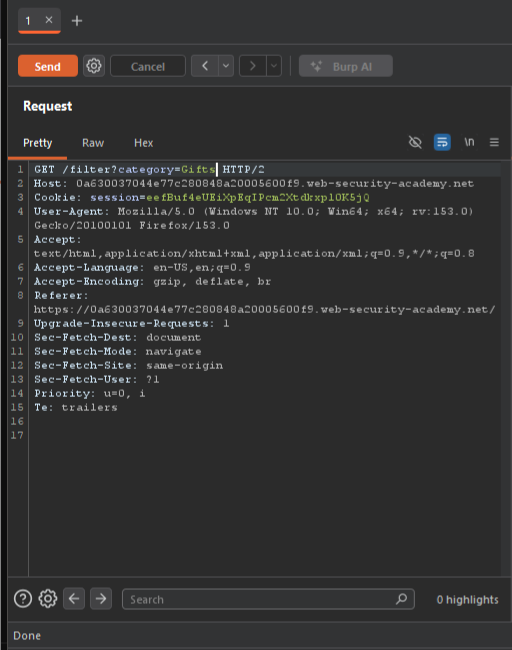
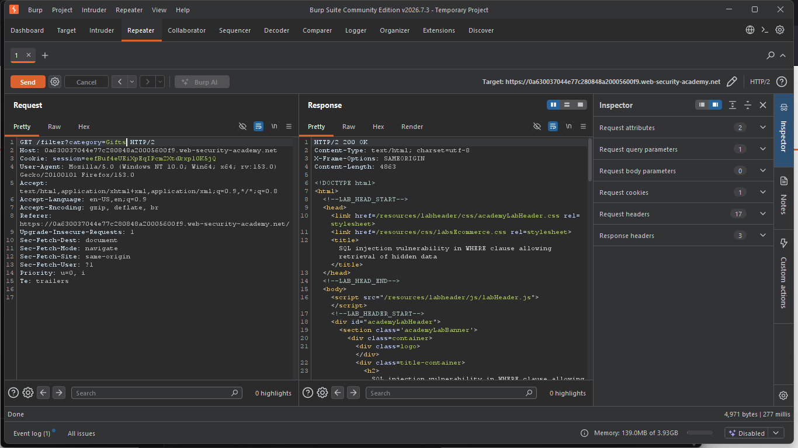
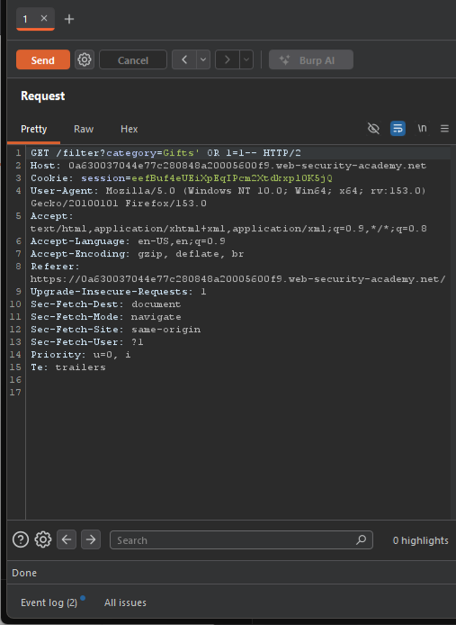
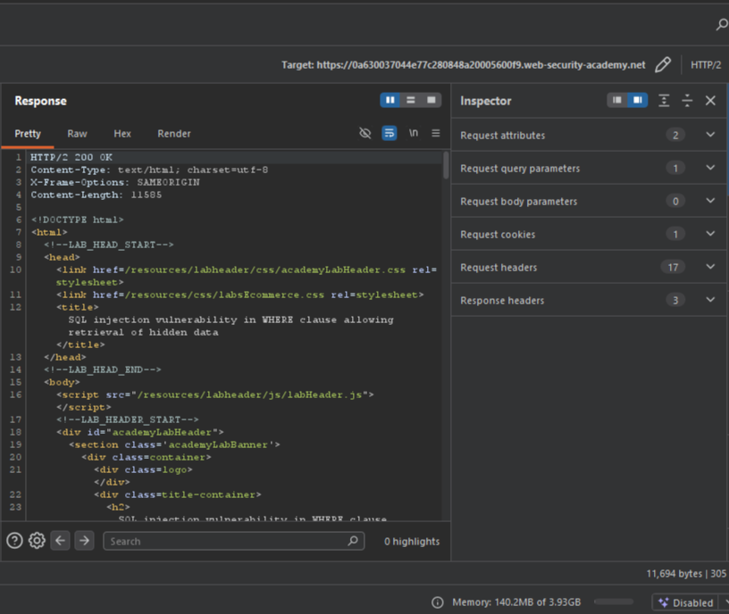

# Lab: SQL Injection — Filter Bypass  https://portswigger.net/web-security/sql-injection/lab-retrieve-hidden-data

## Summary — SQLi. SQL injection vulnerability in WHERE clause allowing retrieval of hidden data. The application directly concatenates the category parameter into a SQL query string without using parameterized queries or proper input sanitization.
This allows attackers to inject arbitrary SQL syntax that the database executes as part of the original query.

## Evidence - 





##Injection point —​```
query = f"SELECT * FROM products WHERE category = '{category}' AND released = 1"
​``` was the injection point. I identified it by reasoning about what the server does behind the scenes:
category is a string filter that gets concatenated: WHERE category = ' + category + '
productId is an integer primary key that likely uses parameterized queries or integer validation
String concatenation on user-controlled input = injection vulnerability; integers with validation = typically safe

Payload — category=Gifts' OR 1=1 --.
' — Closes the opening quote around 'Gifts' in the original query. Now I control what comes after the string value.

OR 1=1 — Adds a condition that's always true. 1=1 evaluates to true, so OR 1=1 makes the entire WHERE clause true for every row, bypassing the category filter.

-- — SQL comment delimiter. Everything after -- is ignored by the database, canceling out the trailing AND released = 1 that would otherwise filter results.

## Impact — On a real site, an attacker could:
Kill the "bypass authentication," "DROP TABLE," "PCI violation" lines — none of that is demonstrated by this lab. Replace with something like: what you actually proved (full unauthorized read of the product catalog bypassing intended filtering), then one sentence bridging to real-world severity if this pattern existed in a login or admin context — clearly labeled as extrapolation, not this lab's proven impact.

## Remeditation — Use parameterized queries (prepared statements):
# Vulnerable (string concatenation):
query = f"SELECT * FROM products WHERE category = '{category}' AND released = 1"

# Fixed (parameterized):
query = "SELECT * FROM products WHERE category = ? AND released = 1"
cursor.execute(query, (category,))

## Severity High — unauthenticated data exposure via direct query manipulation
Additional defenses:

Input validation: Ensure category matches expected patterns (e.g., [a-zA-Z]+)

Whitelist allowed values: Only accept categories from a predefined list

Never trust user input: Treat all parameters as dangerous until validated

Use ORM frameworks: They automatically parameterize queries by default
