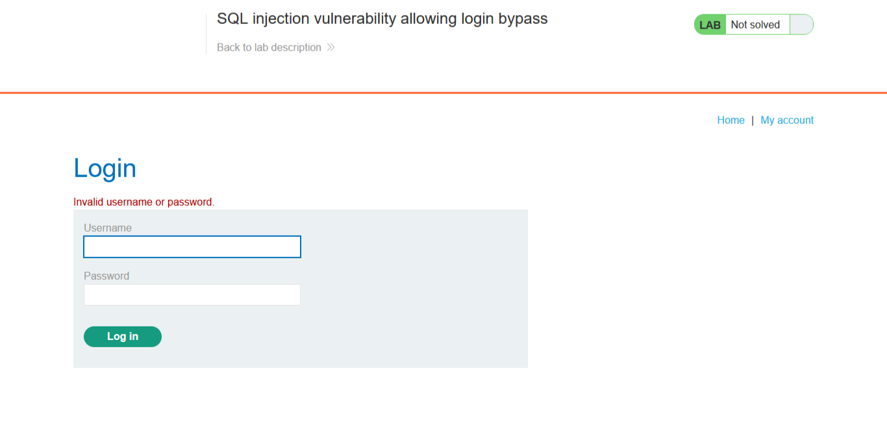
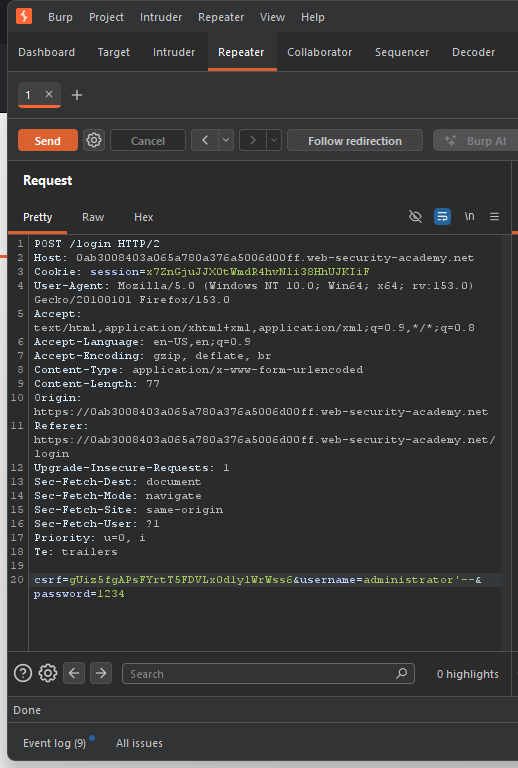
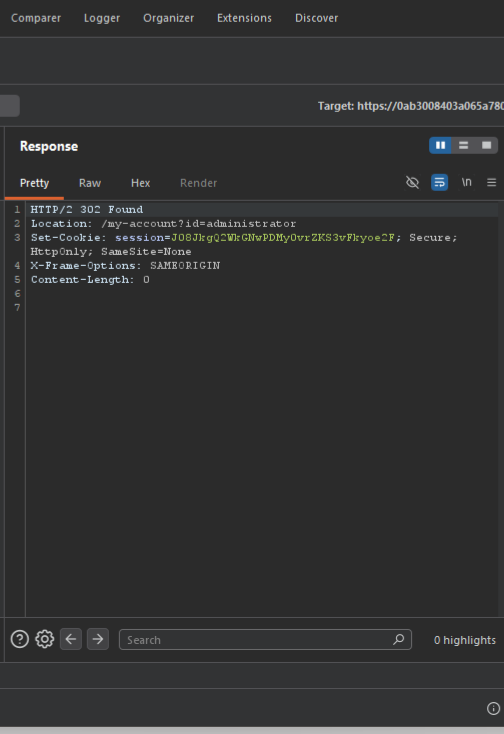
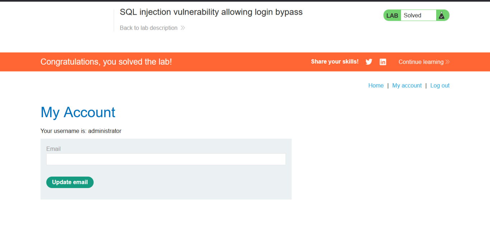

# Lab: SQL Injection Vulnerability Allowing Login Bypass
https://portswigger.net/web-security/sql-injection/lab-login-bypass

## Summary
SQL injection vulnerability in the login form's authentication query, allowing an attacker to bypass password verification entirely and authenticate as an arbitrary user without knowing their credentials. The application concatenates the `username` and `password` parameters directly into a SQL query without parameterization, allowing SQL comment syntax to disable the password check.

## Steps to Reproduce
1. Attempted login with candidate usernames (`Administrator`, `Admin`, `administrator`) and a fixed test password (`1234`) — all returned a generic "Invalid username or password" error, with no distinction between invalid username and invalid password
2. Intercepted the login POST request in Burp Suite and sent it to Repeater
3. Modified the `username` parameter to `administrator'--`, keeping the password field as `1234`
4. Sent the request and observed `HTTP/2 302 Found`, `Location: /my-account?id=administrator`, and a newly issued `Set-Cookie: session=...` value
5. Followed the redirect in-browser and confirmed authenticated access to the administrator account

## Evidence

**Invalid login attempt (generic error, no user enumeration):**


**Successful payload request in Burp Repeater:**


**Server response confirming bypass:**


**Authenticated account page:**


## Injection Point
The injection point was the `username` parameter in the login form's POST request to `/login`. The application's authentication query is structurally similar to:

```python
query = f"SELECT * FROM users WHERE username = '{username}' AND password = '{password}'"
```

- Both `username` and `password` are string values concatenated directly into the query
- No parameterization or input sanitization is applied before the query executes
- The request body also includes a `csrf` token, which is a session-bound anti-CSRF value the application generates per session — this must be a valid, current token from the same session performing the request, or the server rejects the request outright regardless of the SQLi payload. It is unrelated to the SQL injection itself; it's a separate control that has to be satisfied first.

## Payload
`username=administrator'--` with `password=1234` (password value is irrelevant once the payload executes)

- `'` — closes the opening quote around `'administrator'` in the query
- `--` — SQL comment delimiter; everything after it, including `AND password = '{password}'`, is ignored
- The resulting effective query becomes: `SELECT * FROM users WHERE username = 'administrator'` — no password check is performed at all, so the query returns the administrator's row unconditionally

## Impact
This vulnerability allowed complete authentication bypass as a specific, named user (`administrator`) without knowledge of their password. Confirmed via a `302 Found` response with a `Location` header pointing to `/my-account?id=administrator`, a newly issued session cookie, and a subsequent authenticated page load displaying "Your username is: administrator."

This is a more severe finding than a simple filter bypass: it grants an attacker full account takeover of a targeted user, including privileged accounts, without any credential knowledge. If the targeted account has administrative privileges (as in this case), the impact extends to full administrative control over the application.

## Remediation
Use parameterized queries (prepared statements) instead of string concatenation for authentication queries.

**Vulnerable (string concatenation):**
```python
query = f"SELECT * FROM users WHERE username = '{username}' AND password = '{password}'"
```

**Fixed (parameterized):**
```python
query = "SELECT * FROM users WHERE username = ? AND password = ?"
cursor.execute(query, (username, password))
```

**Additional defenses:**
- Hash and salt passwords server-side; never compare plaintext passwords in a query
- Rate-limit login attempts to slow down enumeration and brute-force attempts
- Use parameterized queries or an ORM for all authentication logic without exception
- Log and alert on repeated failed login attempts with anomalous payload patterns (e.g. SQL metacharacters in username field)

## Severity
Critical — unauthenticated full account takeover of an arbitrary, targeted user, including privileged accounts.
