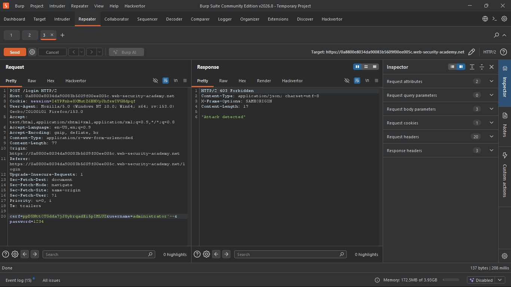
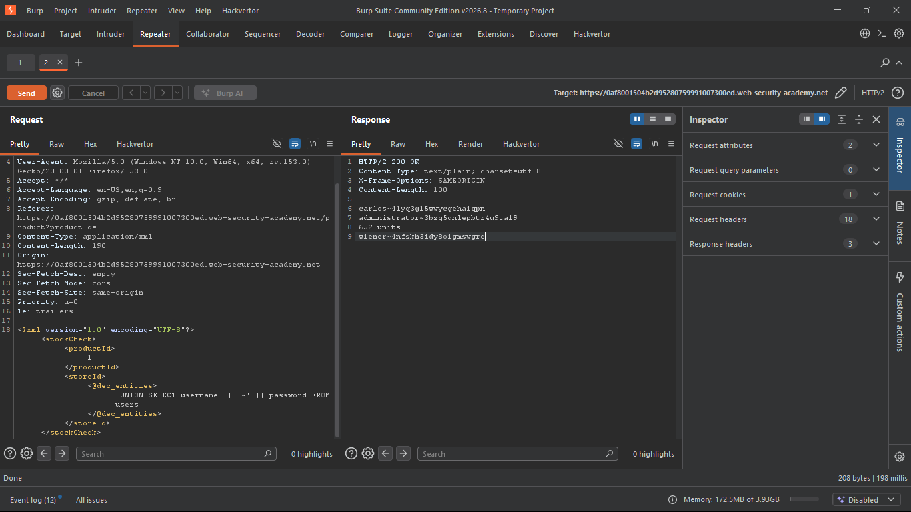
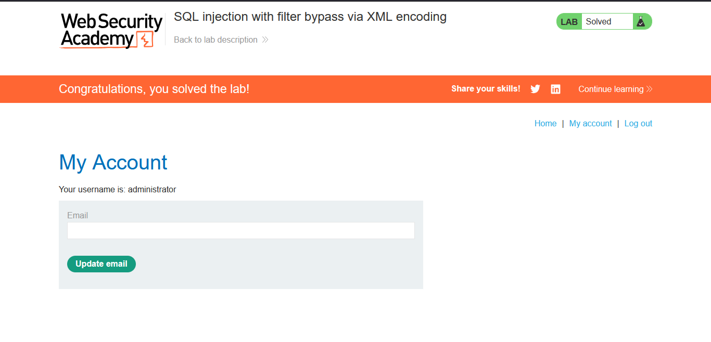

# Lab: SQL Injection with Filter Bypass via XML Encoding
https://portswigger.net/web-security/sql-injection/lab-sql-injection-with-filter-bypass-via-xml-encoding

## Summary
SQL injection vulnerability in the stock-check feature, protected by a WAF performing signature-based detection on the raw request body. The WAF was bypassed by encoding the injection payload as XML character entities, which the WAF does not recognize as SQLi syntax but the backend XML parser decodes into plain SQL before it reaches the database — a parser differential between the WAF and the application layer.

## Steps to Reproduce
1. Selected a product at random and observed the stock-check feature sends `productId` and `storeId` to the backend in an XML request body (`POST /product/stock`)
2. Sent the request to Burp Repeater; confirmed it was submitted as `Content-Type: application/xml`, not a standard form/query parameter
3. Initially tested `productId` as the injection point — no effect observed; re-examined the request and identified `storeId` as the actual injection point
4. Confirmed exploitability by appending `UNION SELECT NULL` to `storeId` to enumerate the number of columns returned by the original query
5. Attempted a direct `UNION SELECT` payload targeting `users.username` and `users.password` — blocked by the WAF with `403 Forbidden` / `"Attack detected"` (confirmed the WAF inspects raw request bodies for known SQLi signatures)
6. Re-attempted the same payload, this time encoding it as XML character entities using Burp's Hackvertor extension (`dec_entities` tag)
7. The encoded request passed the WAF; the backend XML parser decoded the entities back into plain SQL before query execution, successfully bypassing the filter
8. Confirmed extraction of `administrator`'s credentials and logged in

## Evidence

**WAF blocking unencoded payload (403 Forbidden — "Attack detected"):**


**Encoded payload request and response via Hackvertor (bypassing WAF):**


**Authenticated as administrator after credential extraction:**


## Injection Point
The injection point was the `<storeId>` element in the XML body of the `POST /product/stock` request. The original query is structurally similar to:

​```python
query = f"SELECT stock FROM stock WHERE productId = '{productId}' AND storeId = '{storeId}'"
​```

- The XML body is parsed server-side and its values concatenated into a SQL query without parameterization
- `<productId>` was tested first and showed no injectable behavior; `<storeId>` was confirmed as the actual injection point
- Column count was confirmed via `<storeId>1 UNION SELECT NULL</storeId>` before constructing the final payload — [fill in what the actual response/error was here, and whether one NULL was correct or you needed to add more]

## Payload
Final payload, before encoding:
`1 UNION SELECT username || '~' || password FROM users`

Delivered wrapped in a Hackvertor `dec_entities` tag:
